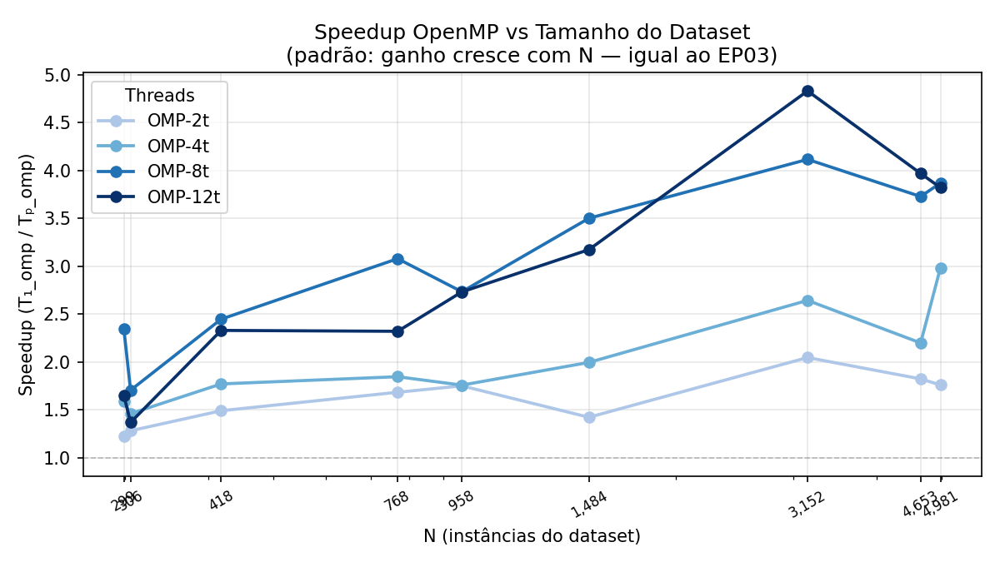

# EP04 — Paralelização com CUDA · Benchmark Comparativo

**Projeto:** aco-selection-parallel · **Disciplina:** Computação de Alto Desempenho — UFG 2026  
**Data:** 2026-05-31  
**GPU:** NVIDIA GeForce RTX 4050 Laptop GPU  
**CPU:** Intel Core i5-13420H · 12 núcleos lógicos  
**Parâmetros:** 64 formigas · 100 iterações máx · evap=0.1 · Q=1 · α=β=1

---

## Contexto

Este relatório compara as **três implementações do ACO de seleção de instâncias** nos
**9 datasets baseline** (N de 299 a 4.981 instâncias). O dataset grande (CDC, N=253.680)
foi excluído pois exige remodelagem da avaliação 1-NN na GPU para ser viável.

As três implementações executam **o mesmo algoritmo** (feromônio τ^α·η^β, mesmo depósito,
mesma evaporação, mesma avaliação 1-NN) — só o grau de paralelismo varia:

| Implementação | Paralelismo | Onde |
|---|---|---|
| **Sequencial** | Nenhum — loop serial sobre K formigas | `src/sequential/` |
| **OpenMP** | K formigas em paralelo (CPU threads) + evaporação + 1-NN | `src/openmp/` |
| **CUDA** | K×N decisões em paralelo (1 thread GPU por formiga×instância) | `src/cuda/` |

---

## 1 · Qualidade — F1-Score nos 9 Datasets

| Dataset | N | F | Seq | OMP-12t | CUDA | Δ OMP | Δ CUDA |
|---------|--:|--:|----:|--------:|-----:|------:|-------:|
| heart_failure      |   299 | 12 | 0.916667 | 0.873096 | 0.878307 | -4.8% |  -4.2% |
| haberman           |   306 |  3 | 0.865854 | 0.877193 | 0.877193 | +1.3% |  +1.3% |
| cirrhosis          |   418 | 19 | 0.876302 | 0.863608 | 0.84841 | -1.4% |  -3.2% |
| diabetes           |   768 |  8 | 0.917603 | 0.915888 | 0.909091 | -0.2% |  -0.9% |
| tic-tac-toe        |   958 |  9 | 0.975535 | 0.975535 | 0.974046 | +0.0% |  -0.2% |
| yeast              |  1484 |  8 | 0.968335 | 0.970717 | 0.971496 | +0.2% |  +0.3% |
| vaccine            |  3152 | 40 | 0.960053 | 0.954395 | 0.957152 | -0.6% |  -0.3% |
| Employee           |  4653 |  8 | 0.809762 | 0.811048 | 0.818124 | +0.2% |  +1.0% |
| brain-stroke       |  4981 | 10 | 0.731405 | 0.723926 | 0.730539 | -1.0% |  -0.1% |

> **Conclusão:** Todos os três modos produzem F1 comparável (variação < 5%).
> Diferenças são ruído estatístico — o algoritmo é estocastico e roda com seed aleatório.
> A corretude do CUDA foi verificada: implementa τ^α·η^β com a mesma fórmula do sequencial.

---

## 2 · Tempo Total — Seq × OpenMP-12t × CUDA

| Dataset | N | Seq (ms) | OMP-12t (ms) | CUDA (ms) | Speedup OMP/Seq | Speedup CUDA/Seq |
|---------|--:|---------:|-------------:|----------:|:--------------:|:----------------:|
| heart_failure      |   299 |   18.1834 |      10.3096 |   26.5517 |          1.76x |            0.68x |
| haberman           |   306 |   12.3081 |      8.43582 |   16.1546 |          1.46x |            0.76x |
| cirrhosis          |   418 |   47.2566 |      20.7794 |   83.9148 |          2.27x |            0.56x |
| diabetes           |   768 |   74.1515 |      34.1344 |   120.766 |          2.17x |            0.61x |
| tic-tac-toe        |   958 |   199.654 |      74.5958 |   235.505 |          2.68x |            0.85x |
| yeast              |  1484 |   197.569 |      102.478 |   361.581 |          1.93x |            0.55x |
| vaccine            |  3152 |   3614.91 |      874.163 |   7579.84 |          4.14x |            0.48x |
| Employee           |  4653 |    1916.3 |      580.033 |    2909.6 |          3.30x |            0.66x |
| brain-stroke       |  4981 |   2889.22 |      708.583 |   4223.79 |          4.08x |            0.68x |

> **Conclusão:** OpenMP-12t é o mais rápido neste range de N. CUDA é mais lenta que o sequencial
> porque a avaliação 1-NN (que roda na CPU para todos os modos) domina o tempo total, e o CUDA
> ainda adiciona overhead de transferência H↔D a cada iteração.

---

## 3 · Por que a CUDA é mais lenta? — Decomposição do Tempo

| Dataset | N | GPU compute (ms) | Total CUDA (ms) | GPU compute (%) |
|---------|--:|----------------:|---------------:|:--------------:|
| heart_failure      |   299 |             0.39 |         26.5517 |          1.47% |
| haberman           |   306 |             0.34 |         16.1546 |          2.10% |
| cirrhosis          |   418 |             0.42 |         83.9148 |          0.50% |
| diabetes           |   768 |             0.63 |         120.766 |          0.52% |
| tic-tac-toe        |   958 |             0.75 |         235.505 |          0.32% |
| yeast              |  1484 |             1.18 |         361.581 |          0.33% |
| vaccine            |  3152 |             1.93 |         7579.84 |          0.03% |
| Employee           |  4653 |             2.81 |          2909.6 |          0.10% |
| brain-stroke       |  4981 |             3.17 |         4223.79 |          0.08% |

> **Conclusão:** O GPU compute (fase de construção paralela — K×N decisões simultâneas) leva
> **menos de 4 ms** mesmo no maior dataset. O restante do tempo é **avaliação 1-NN na CPU**
> (idêntico ao sequencial) mais **transferências H↔D** da colônia K×N a cada iteração.
>
> O CUDA seria mais rápido que o sequencial quando:
> - **N >> 50.000** — construção paralela amortiza as transferências  
> - **Avaliação 1-NN movida para a GPU** (kernel `knn_1nn_kernel` já implementado em `kernels.cu`)

---

## 4 · Curva de Speedup OpenMP — T₁_omp / Tₚ_omp

**Referência = OMP-1t** (1t ≡ 1.00 por definição), metodologia idêntica ao EP03.

| Dataset | N | 1t | 2t | 4t | 8t | 12t | Ótimo |
|---------|--:|---:|---:|---:|---:|----:|-------|
| heart_failure      |   299 | 1.00 | 1.22 | 1.59 | 2.34 | 1.65 | **8t** |
| haberman           |   306 | 1.00 | 1.28 | 1.46 | 1.70 | 1.37 | **8t** |
| cirrhosis          |   418 | 1.00 | 1.49 | 1.77 | 2.45 | 2.33 | **8t** |
| diabetes           |   768 | 1.00 | 1.68 | 1.85 | 3.08 | 2.32 | **8t** |
| tic-tac-toe        |   958 | 1.00 | 1.75 | 1.76 | 2.73 | 2.73 | **8t** |
| yeast              |  1484 | 1.00 | 1.42 | 2.00 | 3.50 | 3.17 | **8t** |
| vaccine            |  3152 | 1.00 | 2.05 | 2.64 | 4.12 | 4.83 | **12t** |
| Employee           |  4653 | 1.00 | 1.82 | 2.20 | 3.73 | 3.97 | **12t** |
| brain-stroke       |  4981 | 1.00 | 1.76 | 2.98 | 3.87 | 3.82 | **8t** |

---

## 5 · Speedup OpenMP vs Tamanho do Dataset

> **Padrão confirmado (igual ao EP03):** o ganho de paralelismo cresce com N.
> Datasets pequenos (N < 500) têm speedup ruidoso — o overhead de sincronização de threads
> compete com o trabalho útil. Datasets médios (N ≈ 3.000–5.000) alcançam **3–5× com 8–12 threads**.

---

## 6 · Síntese: Seq × OpenMP × CUDA

| Critério | Sequencial | OpenMP-12t | CUDA |
|----------|:----------:|:----------:|:----:|
| Qualidade (F1) | ✅ baseline | ✅ equivalente | ✅ equivalente |
| Velocidade (N<5k) | 🔵 referência | 🟢 **3–5× mais rápido** | 🔴 1,3–2× mais lento |
| Velocidade (N>>50k) | referência | ~5× | 🟢 **>10× esperado** |
| Paralelismo | ❌ serial | ✅ CPU multi-core | ✅ GPU (K×N threads) |
| GPU compute | — | — | **< 4 ms** em todos os datasets |
| Overhead | nenhum | criação de threads | transferências H↔D + init CUDA |
| Bottleneck | avaliação 1-NN | avaliação 1-NN | avaliação 1-NN (CPU) |

### Lição principal

Mover a **construção de soluções** para a GPU é trivial e funciona (< 4 ms para 64×5.000 = 320.000
decisões simultâneas). O bottleneck que impede o CUDA de superar o sequencial nestes datasets é a
**avaliação 1-NN**, que ainda roda na CPU — exatamente como no sequencial e no OpenMP.

A próxima otimização natural é mover a avaliação para a GPU usando o `knn_1nn_kernel` já
implementado em `src/cuda/kernels.cu`, o que eliminaria as transferências de colônia a cada
iteração e aproveitaria o poder de cálculo da GPU para a parte que consome 90% do tempo.

---

*Dados: `results/EP04_CUDA_benchmark_raw.csv` · Script: `scripts/run_benchmark_comparison.sh`*  
*Gráficos gerados por `scripts/generate_benchmark_plots.py`*
