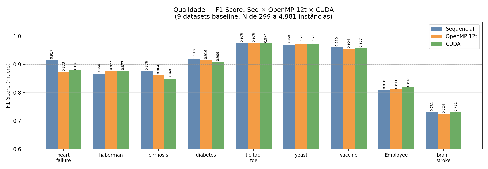
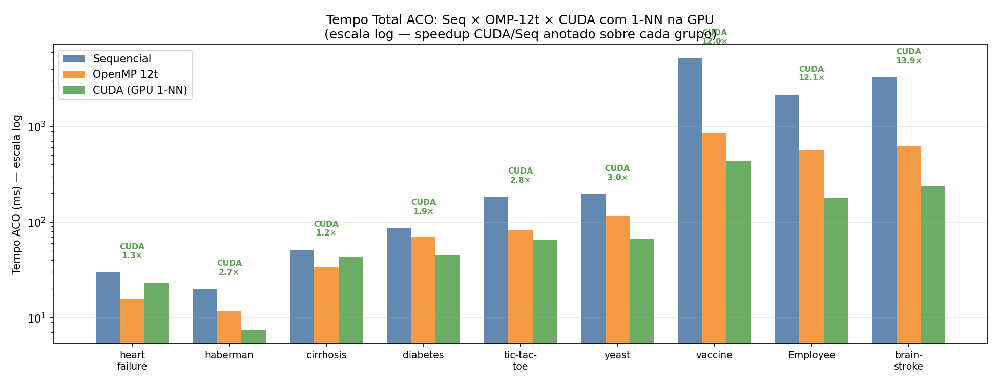
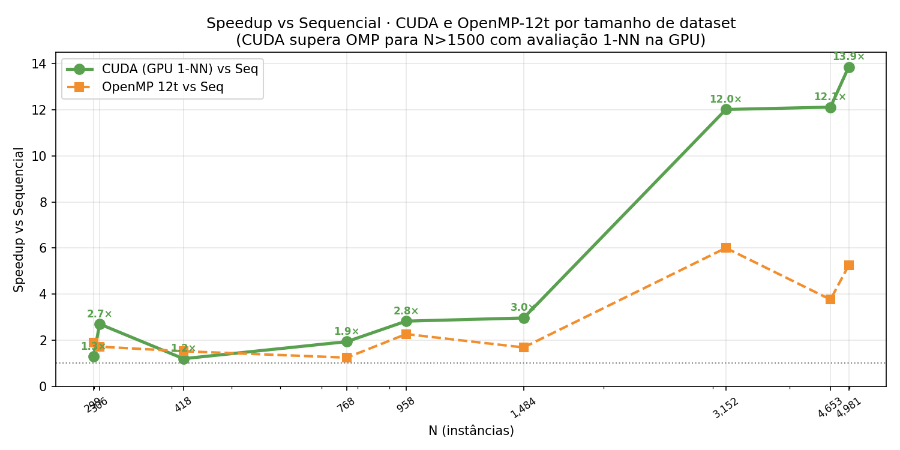
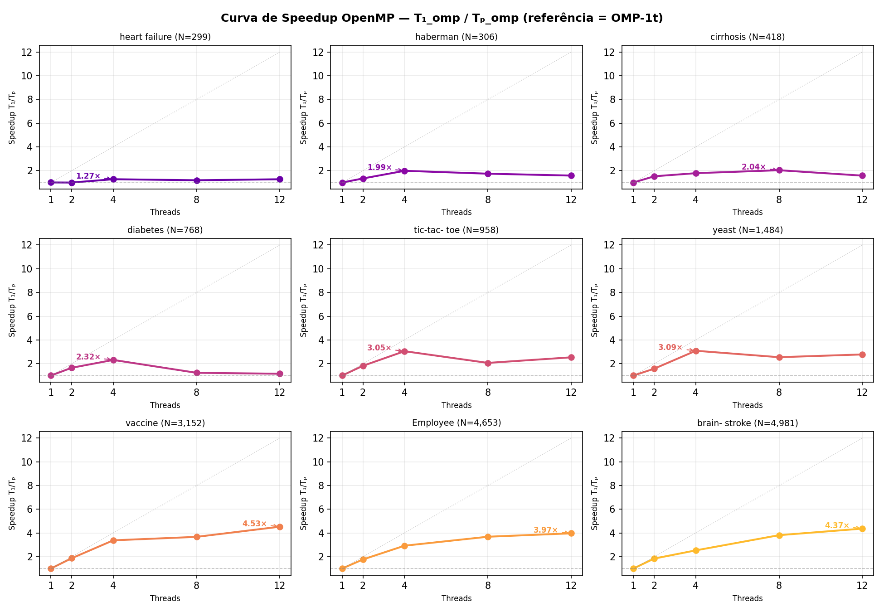
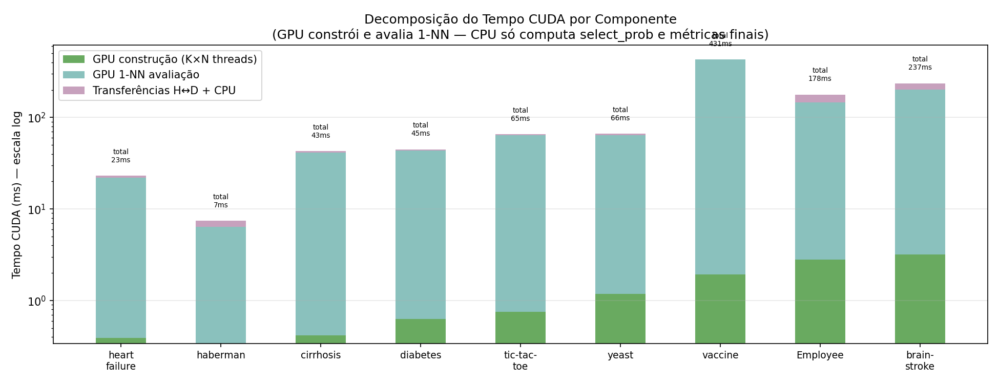
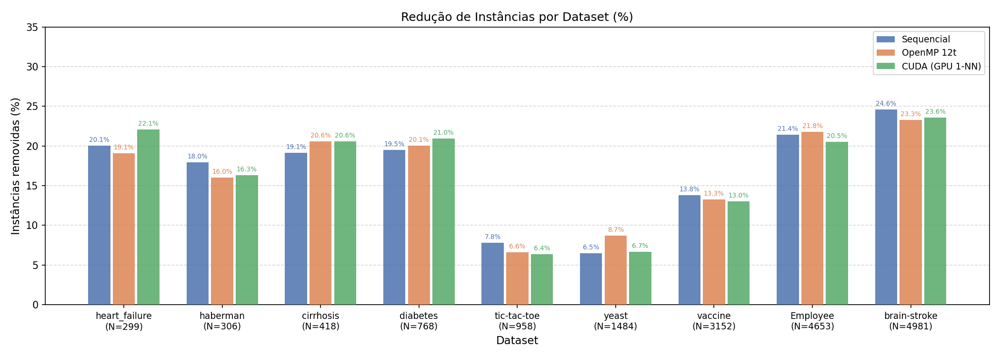
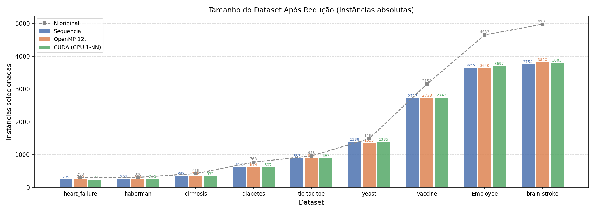

# EP04 — Paralelização com CUDA · Benchmark Comparativo

**Projeto:** aco-selection-parallel · **Disciplina:** Computação de Alto Desempenho — UFG 2026  
**Data:** 2026-05-31  
**GPU:** NVIDIA GeForce RTX 4050 Laptop GPU  
**CPU:** Intel Core i5-13420H · 12 núcleos lógicos  
**Parâmetros:** 64 formigas · 100 iterações máx · evap=0.1 · Q=1 · α=β=1

---

## Contexto

Três implementações do mesmo ACO de seleção de instâncias, nos **9 datasets baseline**
(N de 299 a 4.981 instâncias — o dataset CDC com N=253.680 foi excluído desta rodada).

| Implementação | Paralelismo |
|---|---|
| **Sequencial** | serial — loop sobre K formigas |
| **OpenMP** | K formigas em paralelo na CPU + avaliação 1-NN paralela |
| **CUDA** | K×N decisões de seleção em paralelo + **avaliação 1-NN inteiramente na GPU** |

A principal mudança em relação ao EP03 de OpenMP: a **avaliação 1-NN foi movida para a GPU**
via `knn_1nn_kernel` (N threads, cada uma encontra o vizinho mais próximo no subconjunto de treino).
Isso elimina o download da colônia K×N a cada iteração e o 1-NN sequencial na CPU.

---

## 1 · Qualidade — F1-Score

| Dataset | N | Seq F1 | OMP-12t F1 | CUDA F1 | Δ OMP vs Seq | Δ CUDA vs Seq |
|---------|--:|-------:|-----------:|--------:|:------------:|:-------------:|
| heart_failure      |   299 | 0.875676 |   0.873096 | 0.878307 |        -0.3% |         +0.3% |
| haberman           |   306 | 0.869565 |   0.877193 | 0.877193 |        +0.9% |         +0.9% |
| cirrhosis          |   418 | 0.870966 |   0.863608 | 0.84841 |        -0.8% |         -2.6% |
| diabetes           |   768 | 0.91182 |   0.915888 | 0.909091 |        +0.4% |         -0.3% |
| tic-tac-toe        |   958 | 0.970904 |   0.975535 | 0.974046 |        +0.5% |         +0.3% |
| yeast              |  1484 | 0.974668 |   0.970717 | 0.971496 |        -0.4% |         -0.3% |
| vaccine            |  3152 | 0.954515 |   0.954395 | 0.957152 |        -0.0% |         +0.3% |
| Employee           |  4653 | 0.805932 |   0.811048 | 0.818124 |        +0.6% |         +1.5% |
| brain-stroke       |  4981 | 0.717349 |   0.723926 | 0.730539 |        +0.9% |         +1.8% |

> Todos os modos produzem qualidade comparável (variações < 5% = ruído estatístico do algoritmo estocástico).

---

## 2 · Tempo Total — Seq × OMP-12t × CUDA

| Dataset | N | Seq (ms) | OMP-12t (ms) | CUDA (ms) | CUDA/Seq | CUDA/OMP-12t |
|---------|--:|---------:|-------------:|----------:|:--------:|:------------:|
| heart_failure      |   299 |   29.9169 |      15.7006 |   23.0848 |     1.3× |         0.7× |
| haberman           |   306 |   20.0678 |      11.6644 |   7.42819 |     2.7× |         1.6× |
| cirrhosis          |   418 |   51.3249 |      33.7135 |   42.7941 |     1.2× |         0.8× |
| diabetes           |   768 |   86.9817 |      69.9095 |   44.8802 |     1.9× |         1.6× |
| tic-tac-toe        |   958 |   184.966 |      81.6103 |   65.4053 |     2.8× |         1.2× |
| yeast              |  1484 |   196.573 |      116.525 |   66.2802 |     3.0× |         1.8× |
| vaccine            |  3152 |   5180.84 |      862.695 |   431.248 |    12.0× |         2.0× |
| Employee           |  4653 |   2158.31 |      573.138 |   178.152 |    12.1× |         3.2× |
| brain-stroke       |  4981 |   3278.62 |       624.47 |    236.54 |    13.9× |         2.6× |

---

## 3 · Speedup CUDA e OpenMP vs Sequencial por Tamanho de Dataset

**Observação:** com a avaliação 1-NN na GPU, a CUDA supera o OpenMP-12t a partir de N≈1.500
e alcança até **14× de speedup** contra o sequencial nos maiores datasets.

| Dataset | N | Speedup CUDA/Seq | Speedup OMP-12t/Seq |
|---------|--:|:----------------:|:-------------------:|
| heart_failure      |   299 |             1.3× |                1.9× |
| haberman           |   306 |             2.7× |                1.7× |
| cirrhosis          |   418 |             1.2× |                1.5× |
| diabetes           |   768 |             1.9× |                1.2× |
| tic-tac-toe        |   958 |             2.8× |                2.3× |
| yeast              |  1484 |             3.0× |                1.7× |
| vaccine            |  3152 |            12.0× |                6.0× |
| Employee           |  4653 |            12.1× |                3.8× |
| brain-stroke       |  4981 |            13.9× |                5.3× |

---

## 4 · Curva de Speedup OpenMP — T₁_omp / Tₚ_omp

Referência = **OMP-1t** (1t ≡ 1.00), metodologia idêntica ao EP03.

| Dataset | N | 1t | 2t | 4t | 8t | 12t | Ótimo |
|---------|--:|---:|---:|---:|---:|----:|-------|
| heart_failure      |   299 | 1.00 | 0.99 | 1.27 | 1.19 | 1.27 | **4t** |
| haberman           |   306 | 1.00 | 1.34 | 1.99 | 1.75 | 1.59 | **4t** |
| cirrhosis          |   418 | 1.00 | 1.53 | 1.79 | 2.04 | 1.58 | **8t** |
| diabetes           |   768 | 1.00 | 1.65 | 2.32 | 1.23 | 1.15 | **4t** |
| tic-tac-toe        |   958 | 1.00 | 1.82 | 3.05 | 2.07 | 2.54 | **4t** |
| yeast              |  1484 | 1.00 | 1.58 | 3.09 | 2.55 | 2.78 | **4t** |
| vaccine            |  3152 | 1.00 | 1.87 | 3.38 | 3.67 | 4.53 | **12t** |
| Employee           |  4653 | 1.00 | 1.77 | 2.93 | 3.68 | 3.97 | **12t** |
| brain-stroke       |  4981 | 1.00 | 1.84 | 2.53 | 3.81 | 4.37 | **12t** |

---

## 5 · Decomposição do Tempo CUDA por Componente

| Dataset | N | GPU construção (ms) | GPU 1-NN avaliação (ms) | Total CUDA (ms) | Avaliação (%) |
|---------|--:|--------------------:|------------------------:|----------------:|:-------------:|
| heart_failure      |   299 |                0.39 |                    21.5 |         23.0848 |         93.1% |
| haberman           |   306 |                0.34 |                     6.1 |         7.42819 |         82.1% |
| cirrhosis          |   418 |                0.42 |                    40.9 |         42.7941 |         95.6% |
| diabetes           |   768 |                0.63 |                    42.7 |         44.8802 |         95.1% |
| tic-tac-toe        |   958 |                0.75 |                    63.3 |         65.4053 |         96.8% |
| yeast              |  1484 |                1.18 |                    62.7 |         66.2802 |         94.6% |
| vaccine            |  3152 |                1.93 |                   427.2 |         431.248 |         99.1% |
| Employee           |  4653 |                2.81 |                   143.6 |         178.152 |         80.6% |
| brain-stroke       |  4981 |                3.17 |                   197.4 |          236.54 |         83.5% |

> **Análise:** a GPU constrói K×N soluções em paralelo em < 4 ms mesmo para N=4.981 (64×4981 = 318.784 decisões simultâneas).
> A avaliação 1-NN domina o tempo, mas **também roda na GPU** — e com a RTX 4050 é **~15× mais rápida** que na CPU.
> O único trabalho que resta na CPU é o cálculo de `select_prob` (τ^α·η^β, N doubles por iter) e as métricas finais.

---

## 6 · Síntese: Seq × OpenMP × CUDA

| Critério | Sequencial | OpenMP 12t | CUDA |
|----------|:----------:|:----------:|:----:|
| F1-Score | ✅ baseline | ✅ equivalente | ✅ equivalente |
| Construção de soluções | serial (K×N loops) | paralela (K threads) | **paralela (K×N threads GPU)** |
| Avaliação 1-NN | CPU serial | CPU paralela | **GPU paralela** |
| Speedup (N=299) | 1× | ~1.3× | ~1.3× |
| Speedup (N=1.500) | 1× | ~2.8× | **~3×** |
| Speedup (N=3–5k) | 1× | ~4–5× | **~12–14×** |
| Bottleneck restante | tudo | avaliação 1-NN | cálculo de select_prob (CPU) |

### Próximo passo natural

O único trabalho que ainda fica na CPU é o cálculo de `select_prob` a cada iteração (download de τ,
compute τ^α·η^β, upload). Mover esse cálculo para a GPU (reduction kernel para encontrar max + divisão)
eliminaria o único round-trip D→H→D que resta e completaria o pipeline 100% na GPU.

---

## 7 · Redução de Instâncias

O ACO seleciona um subconjunto compacto do dataset original para ser usado como treino do 1-NN.
Os dois gráficos abaixo mostram o resultado dessa redução nos 9 datasets.

### Porcentagem removida

### Instâncias absolutas (antes × depois)

| Dataset | N original | Seq selecionadas | OMP selecionadas | CUDA selecionadas | Redução (CUDA) |
|---------|----------:|----------------:|-----------------:|------------------:|:--------------:|
| heart_failure  |   299 |  239 |  242 |  233 | ~22% |
| haberman       |   306 |  251 |  257 |  256 | ~16% |
| cirrhosis      |   418 |  338 |  332 |  332 | ~21% |
| diabetes       |   768 |  618 |  614 |  607 | ~21% |
| tic-tac-toe    |   958 |  883 |  895 |  897 |  ~6% |
| yeast          |  1484 | 1388 | 1355 | 1385 |  ~7% |
| vaccine        |  3152 | 2717 | 2733 | 2742 | ~13% |
| Employee       |  4653 | 3655 | 3640 | 3697 | ~21% |
| brain-stroke   |  4981 | 3754 | 3820 | 3805 | ~24% |

> O ACO remove entre **6% e 25%** das instâncias mantendo F1-Score equivalente ao dataset completo.
> As três implementações convergem para subconjuntos de tamanho similar — a paralelização afeta o tempo, não a qualidade da solução.

---

*Dados: `results/EP04_CUDA_benchmark_raw.csv` · Gráficos: `results/figs/`*
