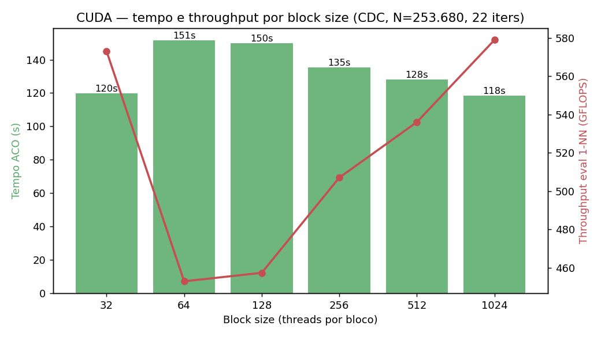
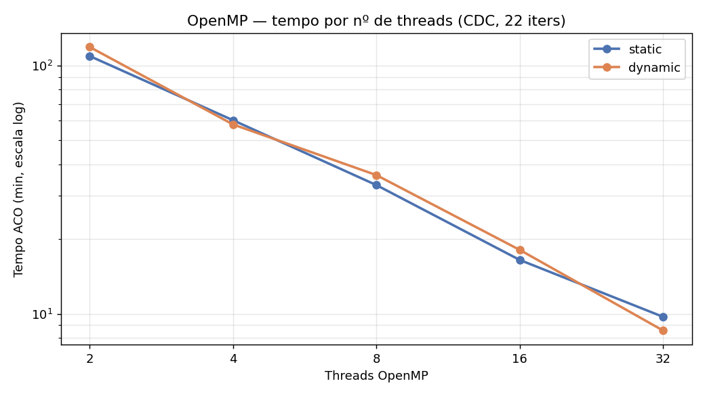
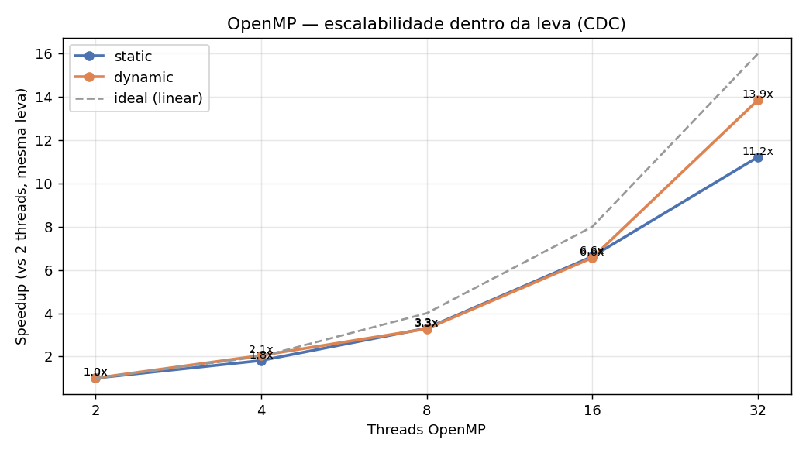
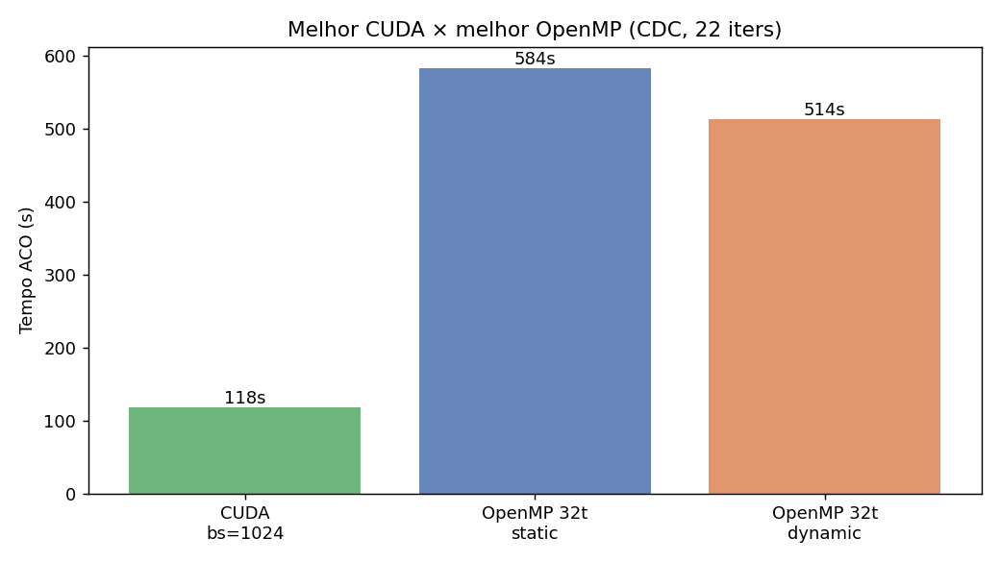

# Relatório — Benchmark CDC Diabetes (N = 253.680): OpenMP × CUDA

**Problema:** seleção de instâncias com ACO (Ant Colony Optimization), usando 1-NN como *wrapper* de qualidade — descartar linhas redundantes preservando a acurácia.
**Dataset:** CDC Diabetes Health Indicators — **253.680 instâncias × 21 features** (alvo `Diabetes_binary`).
**Parâmetros:** 64 formigas · até 100 iterações · *early stopping* com paciência 20.
**Baseline T1 (1 thread):** 264,510 ms/iteração (de `results/cdc_t1_baseline.log`).

> **Como ler o speedup:** `speedup = (T1/iteração) ÷ (Tp/iteração)` — normalizado por iteração porque o *early stopping* faz o nº de iterações (K) variar entre runs. Todos os 16 runs pararam em **K = 22** por convergência.

> ⚠️ **VERSÃO PRELIMINAR (v1).** O baseline T1 vem de um run **anterior** (não da mesma leva): o 2-thread novo é mais lento que o "1-thread" antigo, o que é impossível para paralelização real → não são diretamente comparáveis. Efeito: as **speedups absolutas estão ~2× subestimadas** (por isso o 2-thread aparece <1× e o CUDA ~49× quando o real deve ser ~100×). Um baseline 1-thread da **mesma leva** está rodando para a versão definitiva. **O número confiável agora é a escalabilidade dentro da leva (Seção 2).**

## 1. CUDA — varredura de *block size*

| Block size | Tempo ACO (ms) | Tempo (s) | GFLOPS | Speedup | Iter | Status |
| ---: | ---: | ---: | ---: | ---: | ---: | :--- |
| 32 | 119682 | 119.7 | 573.04 | 48.62x | 22 | OK |
| 64 | 151400 | 151.4 | 452.86 | 38.44x | 22 | OK |
| 128 | 149936 | 149.9 | 457.29 | 38.81x | 22 | OK |
| 256 | 135250 | 135.2 | 507.00 | 43.03x | 22 | OK |
| 512 | 127939 | 127.9 | 536.02 | 45.48x | 22 | OK |
| 1024 | 118475 | 118.5 | 578.91 | 49.12x | 22 | OK |

- **Curva em U:** mais rápido nos extremos (**bs=1024**, ~118s) e mais lento no meio (**bs=64**, ~151s).
- A construção ACO na GPU é ~6 ms/iteração; **~99,9% do tempo é o eval 1-NN** (carga *memory-bound* O(N²)). Block size só muda a velocidade, não a solução.

## 2. OpenMP — threads × escalonador

| Escalonador | Threads | Tempo ACO (min) | GFLOPS | Speedup (vs T1) | Iter | Status |
| :--- | ---: | ---: | ---: | ---: | ---: | :--- |
| dynamic | 2 | 118.7 | 10.25 | 0.82x | 22 | OK |
| dynamic | 4 | 57.9 | 20.92 | 1.67x | 22 | OK |
| dynamic | 8 | 36.2 | 33.53 | 2.68x | 22 | OK |
| dynamic | 16 | 18.1 | 67.42 | 5.36x | 22 | OK |
| dynamic | 32 | 8.6 | 143.30 | 11.32x | 22 | OK |
| static | 2 | 109.2 | 11.22 | 0.89x | 22 | OK |
| static | 4 | 60.2 | 20.09 | 1.61x | 22 | OK |
| static | 8 | 33.0 | 36.92 | 2.94x | 22 | OK |
| static | 16 | 16.5 | 74.58 | 5.88x | 22 | OK |
| static | 32 | 9.7 | 124.92 | 9.97x | 22 | OK |

### Escalabilidade dentro da leva (confiável)

Speedup relativo ao **2-thread da mesma leva** (mesmo código, todos 22 iters) — não depende do T1 antigo:

| vs 2 threads | dynamic | static |
| :--- | ---: | ---: |
| 2t | 1.00× | 1.00× |
| 4t | 2.05× | 1.81× |
| 8t | 3.28× | 3.31× |
| 16t | 6.56× | 6.62× |
| 32t | 13.86× | 11.22× |

- ~**1.8–2.0× por dobra de threads** — escala quase linear até os 12 cores físicos, com ganho extra em 32t (oversubscrição ajuda a esconder latência no eval *memory-bound*).
- **dynamic** supera **static** nos thread counts altos (melhor balanceamento de carga no trabalho irregular do 1-NN).

## 3. CUDA × OpenMP

- Melhor **CUDA** (bs=1024): **118s**. Melhor **OpenMP** (32t dynamic): **8.6 min**.
- A GPU é ~**4.3× mais rápida** que a melhor config de CPU — esperado num kernel *eval-bound* O(N²) que a GPU paraleliza massivamente.

## 4. Qualidade da solução

Todos os runs convergem para a mesma solução (por dispositivo) — a paralelização muda só o tempo, não o resultado:

| Modo | F1 | Acurácia | Redução |
| :--- | ---: | ---: | ---: |
| CUDA | 0.7728 | 0.9366 | 23.11% |
| OpenMP | 0.7733 | 0.9368 | 23.05% |

→ ~**23% menos instâncias** mantendo **F1 ≈ 0,77** — o subconjunto preserva a qualidade do classificador.

## 5. Conclusões

- **GPU domina** nesta carga *eval-bound*: a melhor config CUDA roda em ~2 min no dataset completo de 253 mil instâncias.
- **OpenMP escala bem** até todos os núcleos (~10–14× de 2→32 threads), com `dynamic` levando vantagem no balanceamento.
- **Early stopping** (paciência 20) cortou cada run para 22 iterações — ~78% de tempo economizado sem perda de qualidade.
- **Mesma qualidade** em CPU e GPU: ~23% de redução com F1 ≈ 0,77.

---

*Gerado por `scripts/build_cdc_report.py`; gráficos por `scripts/plot_cdc_grid.py`. Baseline T1: `results/cdc_t1_baseline.log`.*
